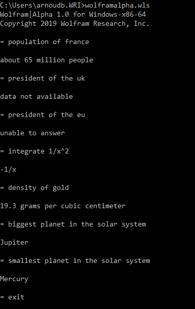

# wolframalpha-commandline

## Direct interface to Wolfram|Alpha for the command line

This [Wolfram Language script](http://www.wolfram.com/wolframscript/) provides a command line interface
to the popular [Wolfram|Alpha website](https://www.wolframalpha.com/). It requires a local Wolfram Engine
to run (e.g. [Wolfram|One](http://www.wolfram.com/wolfram-one/) or [Mathematica](http://www.wolfram.com/mathematica/)). 

Wolfram|Alpha queries are powered by the [Wolfram Knowledgebase](https://www.wolfram.com/knowledgebase/) and the 
[Natural Language Understanding System](https://www.wolfram.com/natural-language-understanding/).

## How to use

After cloning this repository, run `wolframalpha.wls` from a command line to start it up:

    > wolframalpha.wls

Type your Wolfram|Alpha query at the `=` prompt:

    = population of france

And hit `Enter`. This gives you the best possible plaintext answer that Wolfram|Alpha is able to compute:

    about 65 million people

This image shows other possible inputs:

